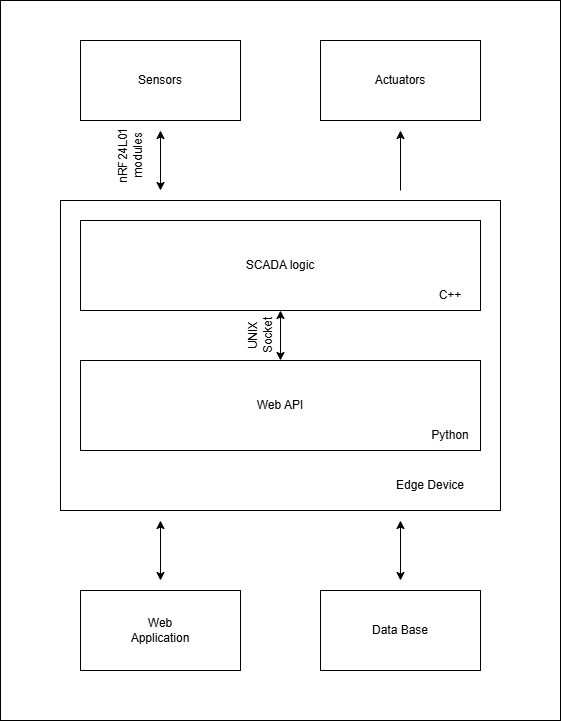

# Greenhouse-Monitoring-and-Automation

# !The project is in progress. All the elements are not fully finished or not implemented yet, and can/might be changed in future!   

# Overall Architecture
   

## Module Descriptions
### Sensor
A device composed of board with *ATmega328P* microcontroller, *nRF24L01* radio module and the set of *environment monitoring sensors*. It binds to an available *Edge Device* and sends sensor data each n-ms period.   
It is written as an Arduino sketch, thus it requires **Arduino IDE** to upload on a chip. I use *Seeeduino Nano*, but it should work with any other board with *ATmega328P* microcontroller

### Edge Device(referred to as '*master*' in code and project's file names)   
A Linux board with GPIOs and the Internet connection.   
Runs two processes:   
-   ***SCADA***.   
-   ***WEB***.
   
Those are connected via Unix Stream Socket for sensor data exchange and configuration of environmental control logic parameters.
   
#### SCADA
The process written in C++ that handles Master-Sensors communication and the environmental control logic.   
Main tasks:   
-   Handles *Sensor* registration/initialization and receives data from them.
-   Sends last acquired data to the *Web process* on demand.
-   Keeps the environmental parameters accordingly to the configuration, received from the *Web process*.

#### WEB
The process written in python with the usage of **Django** framework.   
Main tasks:   
-   Receives data from *SCADA process* and saves it in the *Database*.
-   Handles *Web-App* logic.
-   Set configurations of environmental control logic in the *SCADA process* accordingly to the *Web-App* user input.

### Web Application (Web-App) and Database   
*Web-App* and *Database* handling logic implemented in the *Web process* of the *Edge Device* using **Django** framework.   
*Web-App* provides a user the access to the historical data stored in the *Database* and handles its visualisation. It also makes possible for a user to configure the environmental parameters the *SCADA process* should keep.   
*Database* stores historical data in separate tables for each sensor and in the general one.   
