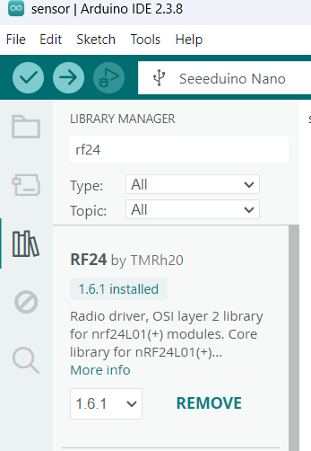
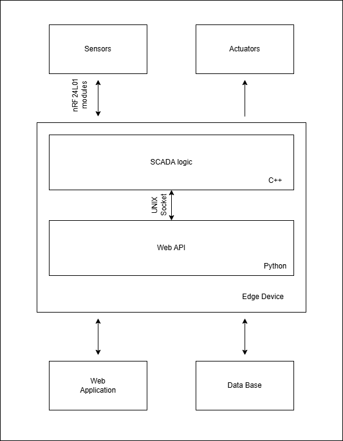

# Greenhouse-Monitoring-and-Automation

# Conventions
*In-project terms, objects or characteristics* (italic)   
**Out-of-project terms, objects or characteristics** (bold)   
***Key words*** (bold italic)   

# Dependencies
-   **RF24** [Click to open installation manual](https://rf24.readthedocs.io/en/v1.4.4/md_docs_linux_install.html) or go to this address rf24.readthedocs.io/en/v1.4.4/md_docs_linux_install.html
-   **Django** `python -m pip install Django`

Both libraries must be installed at the *Edge Device* with Linux.   
   
The *Sensor/s* also requires **RF24** library to be installed. To install it go to **Library Manager** inside **Arduino IDE**, search for **RF24** and press ***Install***.   
   

To generate ***documentation*** use Doxygen command `doxygen Doxyfile`. The ***documentation*** will be generated as .html files inside ***docs*** folder.   
You can download Doxygen here [download doxygen](https://www.doxygen.nl/download.html) or by going to this address www.doxygen.nl/download.html

# Running application
To start the application on the *Edge Device*, enter the next commands inside the projects folder.   
`sudo chmod +x start_master.sh`   
`./start_master.sh`   

The ***Log*** files can be found inside '/build/logs' folder.

# Overall Architecture
   

## Module Descriptions
### Sensor
A device composed of board with **ATmega328P** microcontroller, **nRF24L01** radio module and the set of *environment monitoring sensors*. It binds to an available *Edge Device* and sends sensor data each n-ms period (it is defined in '/src/sensor/sensor.ino' as a *SENSOR_DELAY* macros).   
It is written as an **Arduino sketch**, thus it requires **Arduino IDE** to be uploaded on a chip. I use **Seeeduino Nano**, but it should work with any other board with **ATmega328P** microcontroller.   
*Sensor* can be reset by holding the **Reset Button** for n seconds (defined in '/src/sensor/sensor.ino' as a *RESET_BTN_DELAY* macros). The reset will overwrite *Master ID* to the default value.   

### Edge Device(referred to as '*master*' in code and project's file names)   
A Linux board with GPIOs and the Internet connection.   
Runs two processes:   
-   *SCADA*.   
-   *WEB*.
   
Those are connected via **Unix Socket** for sensor data exchange and configuration of environmental control logic parameters.
   
#### SCADA
The process written in C++ that handles Master-Sensors communication and the environmental control logic.   
Main tasks:   
-   Handles *Sensor* initialization and receives data from them.
-   Sends last acquired data to the *Web process* on demand.
-   Keeps the environmental parameters accordingly to the configuration, received from the *Web process*.

#### WEB
The process written in python with the usage of **Django** framework.   
Main tasks:   
-   Receives data from *SCADA process* and saves it in the *Database*.
-   Provides *Sensors* with unique *Inner IDs* for better readability.
-   Handles *Web-App* logic.
-   Set configurations of environmental control logic in the *SCADA process* accordingly to the *Web-App* user input.

### Web Application (Web-App) and Database   
*Web-App* and *Database* handling logic implemented in the *Web process* of the *Edge Device* using **Django** framework.   
*Web-App* provides a user the access to the historical data stored in the *Database* and handles its visualisation. It also makes possible for a user to configure the environmental parameters the *SCADA process* should keep.   
*Database* stores historical data with ***inner IDs*** and date and time of record creation. The *Sensors* *inner ID* - *sensor ID* (the one stored in *Sensor's* **EEPROM**) pairs are stored in a separate table.   
   
## Data Flow and Communication Logic

### General Overview   
The environmental data flows accordingly to the next sequence:   
*Sensor/s* **-->** *Master(SCADA)* **-->** *Master(Web)*   
Where *Master(SCADA)* is a passive element that listens for messages from *Sensor/s* and *Master(Web)* and sends data only if such a request occurred (in case of *Sensor* initialization or data request from *Web process*).   
   
### *Sensor/s* **-->** *Master(SCADA)*
*Sensor* stores its unique *sensor ID* and *master ID* in its **EEPROM**, both values are 8-bit unsigned integers. By default the *master ID* is set to *MASTER_DEFAULT* value that expands to unsigned 0.   
If the value of *master ID* is set to default, a *Sensor* starts its initialization by sending its *sensor ID* to *"init_address"* that is listened by *Master*.    
After that *Master* sends its own unique *ID* to the *Sensor*, which is the address the data should be sent to.   
When receiving data, *Master* organizes it in a *SENS_FRAME* structure (defined in 'src/master/scada/radio_comm/radio_comm.hpp').   
The received data triggers environmental handling and is stored to be sent on *Web process* demand.
   
### *Master(SCADA)* **-->** *Master(Web)*
*SCADA process* opens **Unix Socket** on its start. *Web process* connects to the opened socket, after that *SCADA process* starts listening for messages from *Web process*.   
There are two types of messages *Web process* can send:
-   *Request message*  
-   *Configuration message*   
   
*SCADA process* identifies the type of a message by the first value sent, which is unsigned 16-bit integer of value 1 for *Configuration message* and 2 for *Request message*.   
   
On a ***data request*** (received *Request message*), *SCADA process* goes through the list of last received *SENS_FRAME* structure for each sensor and gathers the ***active*** ones.   
*Sensor* is identified as ***active*** if the last *SENS_FRAME* was received during the period of 2.5 *Sensor cycles* (1 cycle equals to the value of *SENSOR_DELAY*).   
*SCADA process* sends the number of the active sensors and then each of their *SENS_FRAME*. After receiving *SENS_FRAMEs*, *Web process* checks if each received *sensor ID* already has an *inner ID* associated with it and if none, *Web process* assigns one by adding a corresponding record in the *Sensors* table.   
   
On a ***configuration request*** (received *Configuration message*), *SCADA process* reads 2 values for each environment parameter (*x_perf* and *x_error*) and sets corresponding values inside *Actuator* objects.   